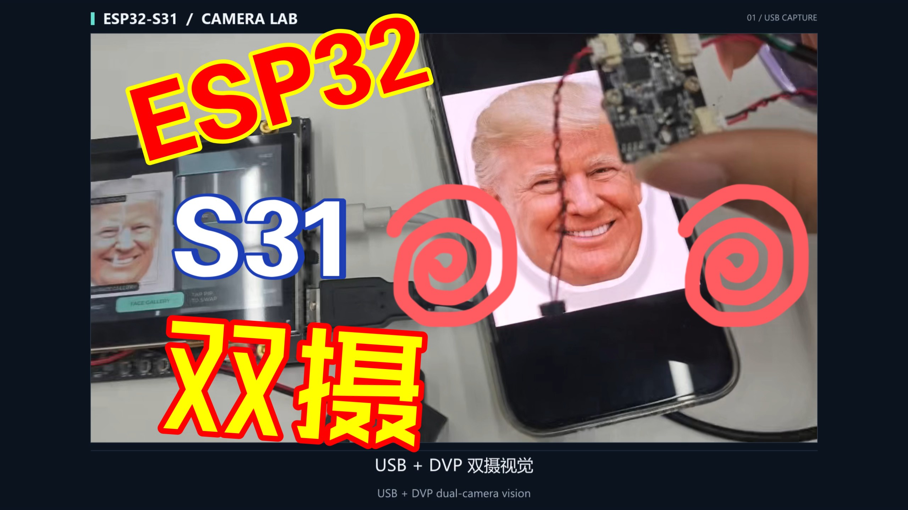
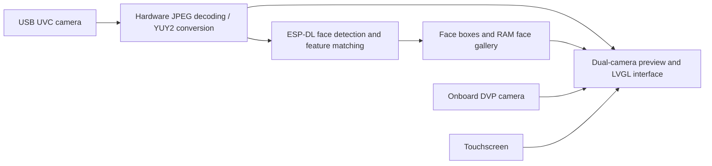

# ESP32-S31 Camera Lab

[简体中文](README.md) | **English**

A dual-camera vision application for ESP32-S31-Korvo-1, combining USB UVC and onboard DVP video capture, picture-in-picture display, and on-device face detection and feature matching. The LVGL touch interface supports swapping camera views, freezing the preview, and managing a local face gallery.

[](https://www.bilibili.com/video/BV1WqeJ6EEQg/)

*ESP32-S31 Camera Lab hardware demonstration video cover. Click to watch.*

Hardware demonstration: **ESP32-S31 Camera Lab — Dual-Camera Vision and Face Recognition**.

[Bilibili](https://www.bilibili.com/video/BV1WqeJ6EEQg/) (video ID: `BV1WqeJ6EEQg`) · [YouTube](https://www.youtube.com/watch?v=IVSqIUNDy-o)

## Features

- **Dual-camera picture-in-picture**: Preview USB and onboard DVP feeds simultaneously. Tap the inset to swap the main and inset views.
- **Local face gallery**: Enroll each identity using three samples and compare facial features against up to 4 stored identities.
- **Multi-face detection**: Display up to 4 detected faces. Identity matching uses the largest face in the frame.
- **Preview controls**: Freeze or resume the preview, and show or hide the status overlay and face boxes.
- **Live status**: View frame rates for both cameras, face count, and AI processing time. The most recent valid frame is retained during brief gaps in camera output.
- **On-chip acceleration**: ESP-DL uses the ESP32-S31 PIE V2 / AI coprocessor capabilities, while USB MJPEG frames use hardware JPEG decoding.

## Hardware and Setup

The validated platform is **ESP32-S31-Korvo-1** with an **800 × 480 RGB touchscreen** and an onboard **OV3660 DVP camera**. The external USB camera must support UVC.

1. Connect the board to a computer through its power / debug port.
2. Connect a UVC camera to the board's **USB Host** port.
3. Power on the board and wait for both camera feeds to appear. By default, USB is the main view and DVP is the inset.

The USB capture path prefers **640 × 480 at 15 FPS using MJPEG**, with a YUY2 fallback at up to 320 × 240. Broad camera compatibility testing has not been performed. The DVP image is flipped horizontally and vertically by default to match the mounting orientation used during validation. For other mounting orientations, adjust [onboard_camera.c](main/onboard_camera.c).

## Touch Controls

| Action | Result |
| --- | --- |
| Tap the inset / `SWAP` | Swap the main and inset views |
| `HOLD` / `LIVE` | Freeze / resume the preview; capture and AI continue in the background |
| `CLEAN` / `HUD` | Hide / show the status overlay and face boxes |
| Long-press the main view with overlays hidden | Freeze / resume the preview |
| `FACE GALLERY` → `+ ADD FACE` | Start enrollment with three samples; face the USB camera and hold still briefly |
| `CANCEL` | Cancel the current enrollment |
| `DELETE LAST` → `CONFIRM DELETE` | Confirm within 4 seconds to delete the most recently enrolled identity |

Before enrollment, resume `LIVE` preview and keep only one face in view. Identities are labeled `PERSON 01`, and so on. **The face gallery is stored only in RAM and is cleared on reboot.** Swapping the camera views does not change the AI input: face recognition always uses the USB camera.

`MATCH` is a similarity score, not a probability that an identity is correct. Recognition accuracy testing and security certification have not been performed.

## Build and Flash

An ESP-IDF toolchain with ESP32-S31 support is required. Validation currently uses an **ESP-IDF 6.2 development version**. See the [build guide](docs/BUILD.md) (Chinese) for the pinned commit and complete instructions. Dependencies are downloaded through ESP-IDF Component Manager; the repository does not bundle the SDK, model binaries, or local caches.

In a terminal with the ESP-IDF environment activated:

```sh
python tools/build.py --jobs 8
```

The application binary is `build/camera_lab.bin`. **Check the partition layout before flashing**: this project's application partition starts at `0x10000`. The binary is not a universal full-flash image for arbitrary boards. On a board with a compatible partition layout already installed, update only the application partition. See the [build guide](docs/BUILD.md) (Chinese) for the commands and the separate first-time deployment procedure.

## Implementation and Acceleration



The AI task is pinned to Core 1 and uses ESP-DL's accelerated implementation for ESP32-S31. LCD / LVGL runs on Core 0. The display path uses double buffering, an internal-RAM bounce buffer, and stable frame references to reduce memory bandwidth pressure while camera capture, AI, and the RGB display run concurrently.

For the acceleration interfaces, see Espressif's [PIE / AI coprocessor documentation](https://docs.espressif.com/projects/esp-idf/en/latest/esp32s31/api-reference/system/freertos_idf.html#pie-ai-coprocessor-usage) and [JPEG driver documentation](https://docs.espressif.com/projects/esp-idf/en/latest/esp32s31/api-reference/peripherals/jpeg.html).

## Validation and Current Limitations

The original application completed approximately **9 minutes** of continuous testing on one board: USB capture ran at approximately **15 FPS**, the displayed preview at approximately **9 FPS**, and DVP at approximately **5.5 FPS**. The test included 13 swaps between the main and inset views and one face enrollment using three samples.

This test covered functionality and short-term stability. Two JPEG decoding errors occurred; no LCD underruns, USB transfer errors, or system crashes were recorded. Display-path improvements have been implemented to address occasional black flashes, but **longer testing on the physical display is still needed**. See the [validation record](docs/VALIDATION.md) (Chinese) for the standalone project's build results and detailed test data.

## Privacy and Debugging

The application does not enable Wi-Fi, Bluetooth pairing, or cloud uploads. Facial features are used only in local RAM. The repository does not contain enrollment samples, feature databases, unique device identifiers, or flash backups. The hardware demonstration video and cover were provided by the maintainer.

The serial console provides the `camera_status` and `camera_action` debug commands. Explicitly running **`camera_screen` exports the current image over the serial port**; that image may contain people or surroundings. Review debug output before sharing it. See the [debugging guide](docs/DEBUGGING.md) (Chinese).

## Project Structure

```text
main/                       Camera capture, AI service, UI, and application entry point
components/gen_bmgr_codes/   Korvo board configuration and initialization
tools/                      Build helpers
docs/                       Build, debugging, and validation documentation
sdkconfig.defaults          Default configuration
partitions.csv              Partition layout
```

## Origins and Licenses

The project started from Espressif's [official ESP32-S31 example](https://esp32-s31.espressif.com/zh-hans/official-projects/5) and uses [ESP-DL](https://github.com/espressif/esp-dl), [ESP Video Components](https://github.com/espressif/esp-video-components), [ESP USB](https://github.com/espressif/esp-usb), [ESP Board Manager](https://github.com/espressif/esp-board-manager), and [LVGL](https://github.com/lvgl/lvgl).

Application source files use **Apache-2.0** as indicated in their file headers. The retained Espressif board files use **Espressif Modified MIT**, which includes a condition limiting their use to Espressif products. Third-party dependencies retain their respective licenses. **The entire repository must not be treated as unconditionally licensed under Apache-2.0 or MIT.** See [LICENSE](LICENSE) and [THIRD_PARTY_NOTICES.md](THIRD_PARTY_NOTICES.md).
