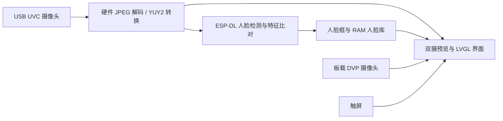

# ESP32-S31 Camera Lab

基于 ESP32-S31-Korvo-1 的双摄像头视觉应用，集成 USB UVC 与板载 DVP 视频采集、画中画显示、本地人脸检测及特征比对。采用 LVGL 触控界面，支持主副画面切换、预览冻结与人脸库管理。

## 功能概述

- **双摄画中画**：USB 与板载 DVP 同时预览，点击画中画切换主副画面。
- **本地人脸库**：支持三样本录入与特征比对，最多保存 4 个身份。
- **多人检测**：最多显示 4 张脸，身份比对使用画面中最大的脸。
- **画面控制**：支持冻结与恢复实时预览，以及信息栏和人脸框的显示控制。
- **实时状态**：显示两路帧率、人脸数量与 AI 耗时；摄像头短暂缺帧时保留最近的有效画面。
- **片上加速**：ESP-DL 使用 ESP32-S31 的 PIE V2 / AI 协处理器能力，USB MJPEG 使用硬件 JPEG 解码。

## 硬件与连接

当前验证平台是 **ESP32-S31-Korvo-1**，配套 **800 × 480 RGB 触摸屏**及板载 **OV3660 DVP 摄像头**。外接 USB 摄像头需符合 UVC 协议。

1. 使用开发板的供电 / 调试接口连接电脑。
2. 将 UVC 摄像头接到开发板的 **USB Host** 接口。
3. 上电后进入双摄界面，等待两路首帧。默认 USB 为大画面，DVP 为小窗。

USB 路径优先使用 **640 × 480、15 FPS、MJPEG**，另有最高 320 × 240 的 YUY2 回退路径；尚未做广泛的摄像头兼容性测试。DVP 默认做水平与垂直翻转，以适配本项目验证时的安装朝向。不同安装方式可调整 [onboard_camera.c](main/onboard_camera.c)。

## 触屏操作

| 操作 | 效果 |
| --- | --- |
| 点击画中画 / `SWAP` | 交换主副画面 |
| `HOLD` / `LIVE` | 冻结 / 恢复预览；采集与 AI 仍在后台运行 |
| `CLEAN` / `HUD` | 隐藏 / 显示信息栏与人脸框 |
| 纯画面模式下长按主画面 | 冻结 / 恢复预览 |
| `FACE GALLERY` → `+ ADD FACE` | 开始三样本录入，面向 USB 摄像头保持片刻 |
| `CANCEL` | 取消本次录入 |
| `DELETE LAST` → `CONFIRM DELETE` | 在 4 秒内确认删除最后一个身份 |

录入时请恢复 `LIVE`，并让画面中只保留一张脸。身份以 `PERSON 01` 等编号显示。**人脸库只存在 RAM 中，重启即清空**。切换主副画面不会改变 AI 的来源，识别始终使用 USB 摄像头。

`MATCH` 表示相似度得分，不是身份判断的概率；本项目未进行识别准确率或安全认证测试。

## 构建与烧录

需要支持 ESP32-S31 的 ESP-IDF 工具链。当前验证基于 **ESP-IDF 6.2 开发版**，固定提交与完整步骤见 [构建说明](docs/BUILD.md)。依赖通过 ESP-IDF Component Manager 下载，仓库不附带 SDK、模型二进制或本机缓存。

在已导出 ESP-IDF 环境的终端中：

```sh
python tools/build.py --jobs 8
```

应用输出为 `build/camera_lab.bin`。**烧录前先核对分区布局**：本项目应用区位于 `0x10000`，不是适配任意板卡的通用整片固件。已有兼容分区布局的板卡只更新应用区；具体命令和首次部署的区别见 [构建说明](docs/BUILD.md)。

## 实现与加速



AI 任务固定在 Core 1，使用 ESP-DL 面向 ESP32-S31 的加速实现；LCD / LVGL 位于 Core 0。显示链路采用双帧缓冲、内部 RAM bounce buffer 和稳定的帧引用，减轻摄像头、AI 与 RGB 屏同时工作时的内存带宽压力。

加速相关接口可参考乐鑫的 [PIE / AI 协处理器说明](https://docs.espressif.com/projects/esp-idf/en/latest/esp32s31/api-reference/system/freertos_idf.html#pie-ai-coprocessor-usage)和 [JPEG 驱动说明](https://docs.espressif.com/projects/esp-idf/en/latest/esp32s31/api-reference/peripherals/jpeg.html)。

## 验证范围与当前限制

原应用在一块开发板上完成约 **9 分钟**连续验证：USB 采集约 **15 FPS**、界面实际呈现约 **9 FPS**，DVP 约 **5.5 FPS**；完成 13 次主副画面切换和一次三样本人脸录入。

本次测试覆盖功能与短时稳定性。测试期间有 2 次 JPEG 解码错误，未记录到 LCD underrun、USB 传输错误或系统崩溃。针对偶发屏幕闪黑已实施显示链路优化，**仍需更长时间的实屏确认**。独立工程的构建结果与详细测试数据见 [验证记录](docs/VALIDATION.md)。

## 隐私与调试

应用不启用 Wi-Fi、蓝牙配对或云端上传；人脸特征仅在本机 RAM 中使用。仓库不包含真实人脸图像、已录入身份、设备唯一标识或烧录备份。

串口提供 `camera_status` 和 `camera_action` 调试命令。显式执行 **`camera_screen` 会通过串口导出当前画面**，画面可能包含人物或环境；分享调试输出前请自行检查。详见 [调试说明](docs/DEBUGGING.md)。

## 项目结构

```text
main/                       双摄采集、AI 服务、界面与入口
components/gen_bmgr_codes/   Korvo 板级配置与初始化
tools/                      构建辅助工具
docs/                       构建、调试与验证说明
sdkconfig.defaults          默认配置
partitions.csv              分区布局
```

## 来源与许可证

项目起点为乐鑫 [ESP32-S31 官方示例](https://esp32-s31.espressif.com/zh-hans/official-projects/5)，并使用 [ESP-DL](https://github.com/espressif/esp-dl)、[ESP Video Components](https://github.com/espressif/esp-video-components)、[ESP USB](https://github.com/espressif/esp-usb)、[ESP Board Manager](https://github.com/espressif/esp-board-manager) 和 [LVGL](https://github.com/lvgl/lvgl)。

应用源文件按文件头标注使用 **Apache-2.0**。保留的乐鑫板级文件使用 **Espressif Modified MIT**，包含仅用于 Espressif 产品的条件。第三方依赖分别适用各自许可证，**不能将整个仓库统一视为无附加条件的 Apache-2.0 或 MIT**。详见 [LICENSE](LICENSE) 与 [THIRD_PARTY_NOTICES.md](THIRD_PARTY_NOTICES.md)。
